# Inventory Optimization

#### Author: Yiran Jing
#### Dec 2019

## Goal:
1. Adjust `Capacity` of items
1. Adjust `facing` of items

### DataSet Description
1. `Distribution Report - Auckland Departures - July19.csv`
2. `sales_newzealand.csv`: Daily sale data (**Sep-Dec**)

#### Assumption:
- Assume total store `facing`
- Assume total store `Capacity`  
- Assume total store `bags`
- `Distribution Report - Auckland Departures - July19.csv` doesnot have the full-list of items sold in store. But currently assume we only need to analysis items shows in this dataset only.
- Assume if daily supply is 0 and not sold in Dec, it is removed product and thus we donot need to analysis it.
- Assume the facing information in July is same as in Dec and reasonable.


***

## Summery of Important Findings:
1. Gross sale, Net sale and Discount includes quite similar information, so we can only pick Gross sale in the following analysis
1. Identified some removed item, save them to `removed_SKU.csv`
1. **We can ignore Seasonal or Time effect for 15_ Liquor**. Since Sale performance of Five Classification is stable over time (Sep-Dec): <br />
   - Each class keeps similar sell pattern in the past 4 month
1. **The dominating factor of classification and capacity decision is sale quantity, rather than sales amount.**
1. From 3 pie charts below we can see that:
   - overall, `B` and `A` account for most sale amount (28+31 = 60%)
   - **The Capacities of some `C` and `A+` items might need to decrease**, since QtySold (%) < Capacity (%)
   - **The Facing of some `A` items might need to increase**, since QtySold (%) < Facings (%)
   - **The capacity of `B` might need to increase**, since QtySold (%) > Capacity (%). Thus we need to check if `B`(which QtySold (%) > Capacity (%)) has OOS issue.
   - **Some `A+` and `A` need less facing**. (from scatter plot: Relationship between Facing and Sold quantity for each SKU)
1. Most popular items are in A+ items (sold most)
1. Relationship between Classification and Price:
   - Cheap item generally in `A`
   - Most Luxuries in `C` class, some of them in `B`
1. Facing has no clear relationship with price.


***
### Next Step Suggestion:
1. Confirm assumtions with store manager
2. Check if `B` (which QtySold (%) > Capacity (%)) has OOS issue.
3. For each item, mainly `A`, `A+`, `B` and `C`,  calculate and compare QtySold (%),Facings (%) and Capacity (%). Then we can identify items which need to adjust capacity or facing. Since the dominating factor of classification and capacity decision is sale quantity.


***

### Steps:
1. Clean data
   1. Rename column and filter data
   1. Generate `monthly gross sale` dataset for each item <br />
   1. Create `price` column
      - $= Gross Sale / Sale Quantity$ (Similar with use net sale, since corr bet NS and GS is 0.999)
   1. Identify and remove the removed item <br />
   we don't need to consider their inventory opti since we will not sell them. <br />
   **Collect these product to a `removed_SKU.csv`, then confirm with Boris if these products were removed forever** <br />
   <br />
   Removed Item Rule : <br />
      1. Supply chain is 0 in July <br />
      2. The number of sale days of this item in Sep-Dec is 0. (no records)<br />
   <br />
   1. Join datasets.
2. Feature Selection
   - Choice Net sale only from Net sale, Gross sale, and discount. <br />
    _(Since the correlation of avg(NetSales) and avg(GrossSales) is quite high (0.999), also based on scatter plot, NS and GS includes quite similar information, and thus, in the following calculation I **use net sale only**.)_ <br />
   and the $discount =  GS - NS$

3. EDA
   Lots of plots below

***
### Question:
1. UPSPW ？？？？ what is the column meaning?
2. Calculate the `average daily sales` for each item use ???: <br />
  holiday effect <br />
  Out of stock effect <br />
  Discount/Promotion effect <br />

### Identify removed Items


    +--------------------+-------+--------+----------+--------------+-----+----------+------------+-------+----------+--------+
    |                 SKU|Facings|Capacity|DaysSupply|Classification|month|avgNetSale|avgGrossSale|avgCOGS|avgQtySold|avgPrice|
    +--------------------+-------+--------+----------+--------------+-----+----------+------------+-------+----------+--------+
    |JW & SONS MASTER ...|    1.0|     1.0|       0.0|             C| null|       0.0|         0.0|   null|      null|    null|
    |JOHNNIE WALKER BL...|    1.0|     3.0|       0.0|             C| null|       0.0|         0.0|   null|      null|    null|
    |JWH 1920 EPIC COL...|    2.0|     2.0|       0.0|             C| null|       0.0|         0.0|   null|      null|    null|
    |PLANTATION ORIGIN...|    3.0|    12.0|       0.0|             B| null|       0.0|         0.0|   null|      null|    null|
    |APPLETON SIGNATUR...|    4.0|    80.0|       0.0|             C| null|       0.0|         0.0|   null|      null|    null|
    +--------------------+-------+--------+----------+--------------+-----+----------+------------+-------+----------+--------+
    only showing top 5 rows


Month is `null` means that this item is not sold from Sep-Dec. Highly likely they where removed.


```python
### Save these item to CSV
Removed_item.toPandas().to_csv('../data/Output/removed_SKU.csv',
                             index=False, encoding='utf-8')
```

## EDA


```python
"""
Number of items in each Classification
"""
class_data = dist_df.groupby("Classification")
count = class_data.count().show()
```

    +--------------+-----+
    |Classification|count|
    +--------------+-----+
    |             B|  231|
    |             D|   12|
    |             C|  239|
    |             A|  134|
    |            A+|   15|
    +--------------+-----+


### Relationship between the average of GS and NS for each SKU
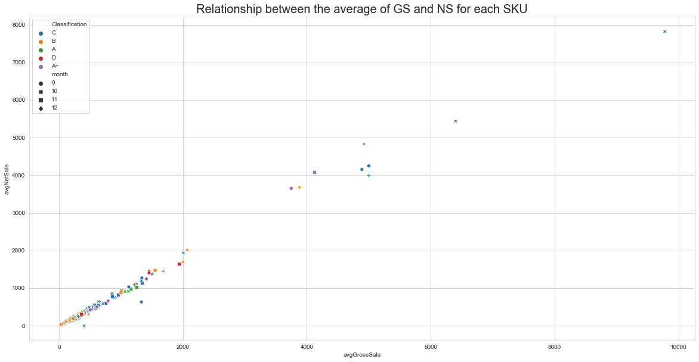


```python
month_merge['avgNetSale'].corr(month_merge['avgGrossSale'])
```
0.9952806262275334


The correlation of avg(NetSales) and avg(GrossSales) is quite high (0.995), also based on scatter plot, NS and GS includes quite similar information. Thus in the following analysis, I choice Gross sale only

Also, since $discount = GS - NS$, and GS includes similar info with NS, so there is no valuable information in discount column

### Sale performance of Five Classification over time


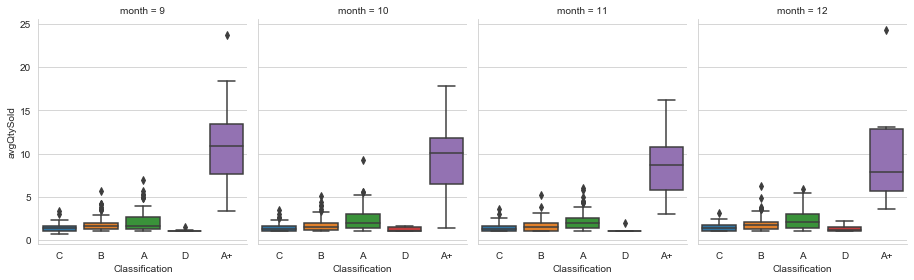


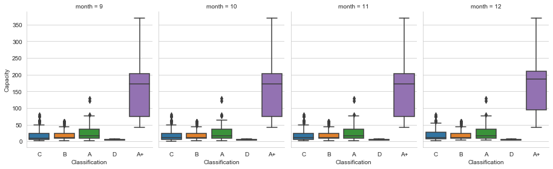


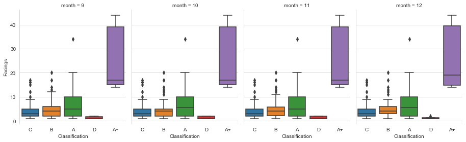


From 9 box plots above we can see that:
1. Most popular items are in A+ items (sold most)
1. Each class keeps similar sell pattern in the past 4 month


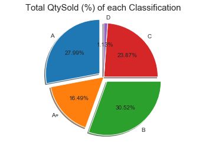


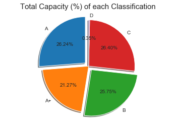


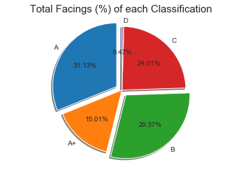


From 3 pie charts above we can see that:
1. overall, `B` and `A` account for most sale amount (28+31 = 60%)
1. **The Capacities of some `C` and `A+` items might need to decrease**, since QtySold (%) < Capacity (%)
1. **The Facing of some `A` items might need to increase**, since QtySold (%) < Facings (%)
1. **The capacity of `B` might need to increase**, since QtySold (%) > Capacity (%). Check if `B` (which QtySold (%) > Capacity (%)) has OOS issue.

### Capacity is decided by Sale Quantity, rather than sale amount

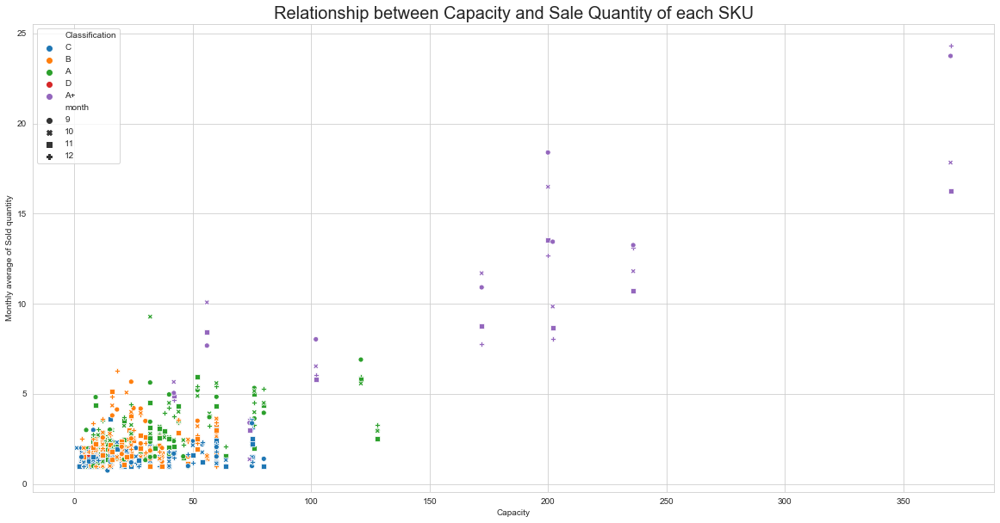


From plot above, we can see that:

The calssification has strong relationship with the quantity sold: **the more sold Qty on average, the higher class**


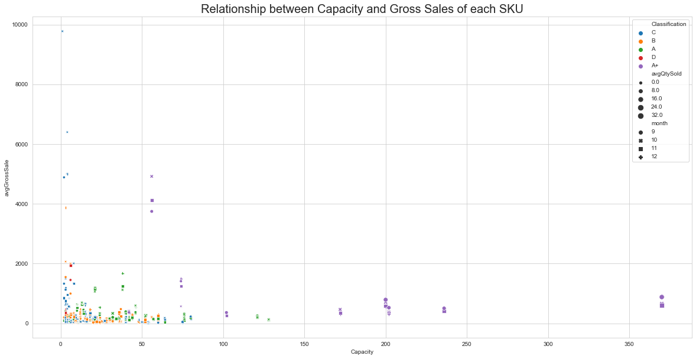


From the plot above, we can see that:
1. There is no clear relationship between capacity and the average of gross sale. Also, Some `A+` items have too many capacities, but not many gross sales, thus we can confirm that the **classification is decided by the quantity sold, rather than sales amount.**
2. **Most `A+` items are cheap, most `C` items are expensive**: <br />
   - Some `C` itens have high cross sale, but low sale quantity, which means that the price is high <br />
   - Most `A+` items have quite high sale quantity and high capacity, but low gross sales, which means that the price is low

### Identify features of each classification

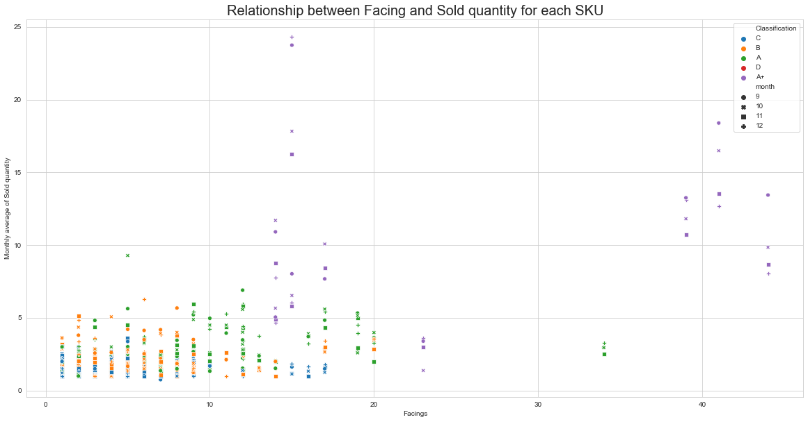


From the plot above, we can see that facing arrangement is not reasonable:
1. Some `A+` need more facing.
2. Some `A+` and `A` need less facing.


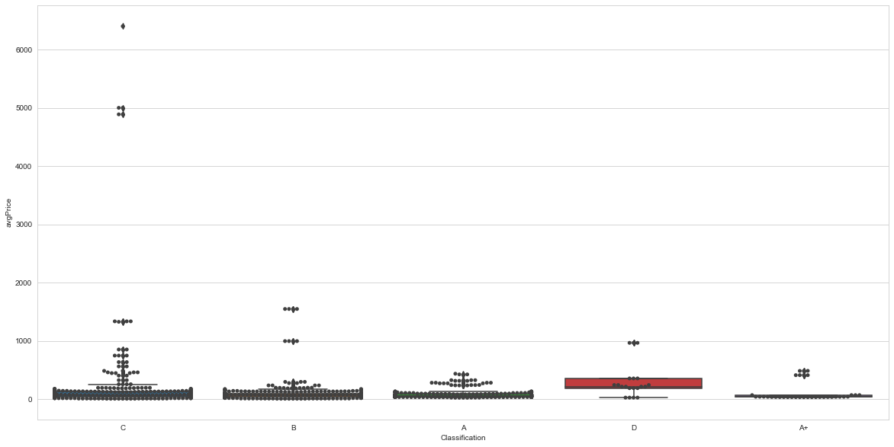


From three plots above, we can see that:
1. Facing has no clear relationship with price
2. Some Luxury in `C` class: quite high price, Low sale Qty.
3. Expensive items are in `C` and `B` class
4. Cheap item generally in `A`
5. `A+` items have more facings.

#### COGS plot


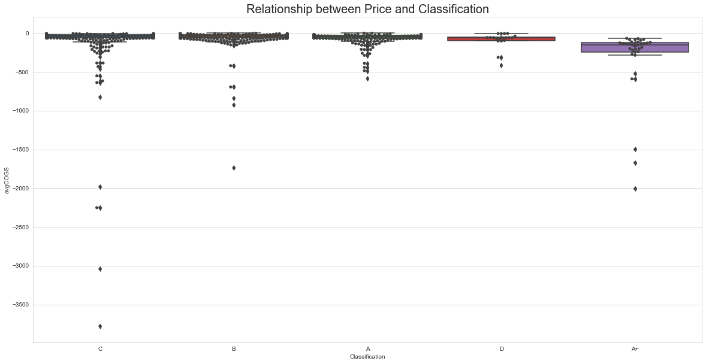


```python
highCOGS = month_merge[month_merge.avgCOGS < -1000 ]
```


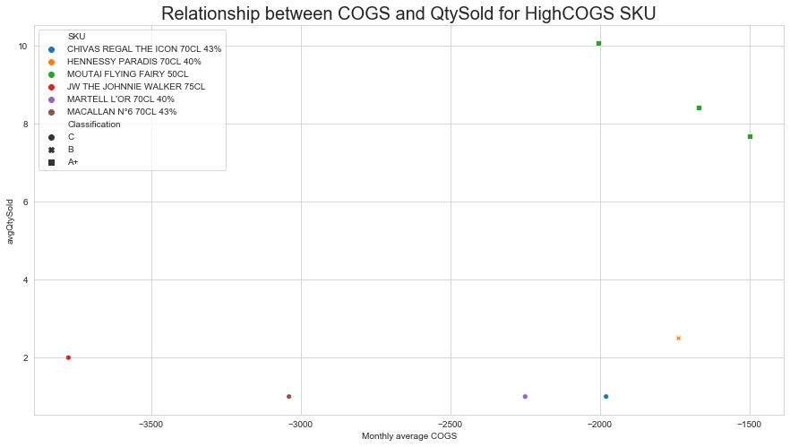
